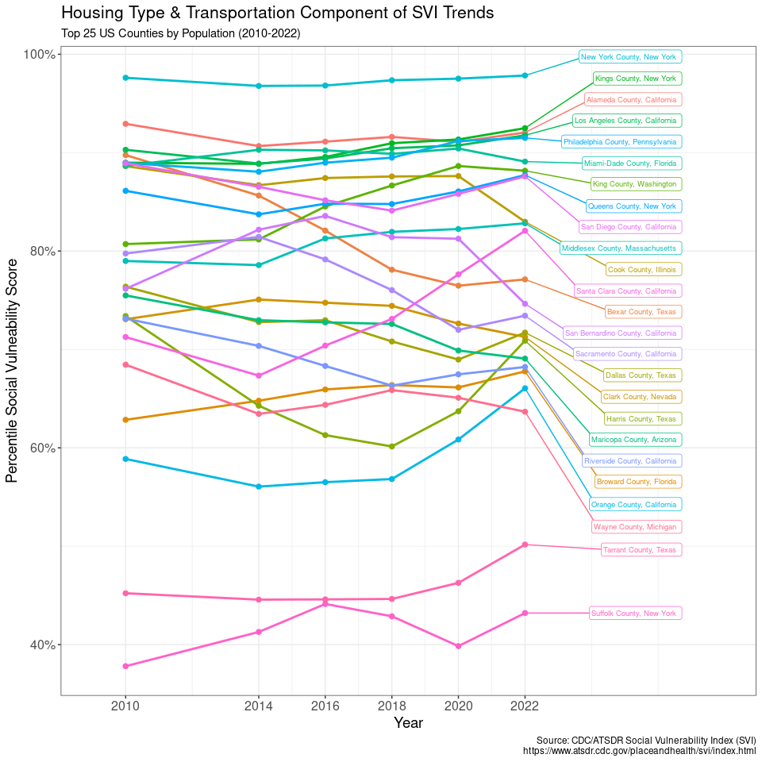
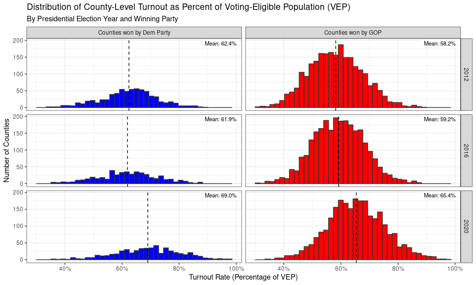
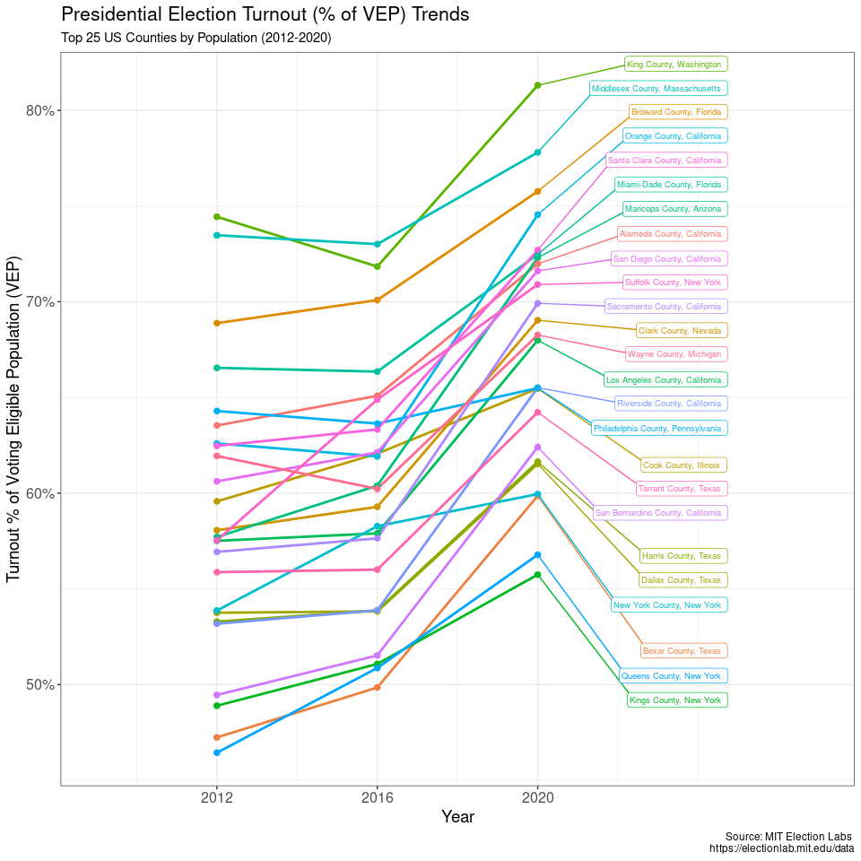
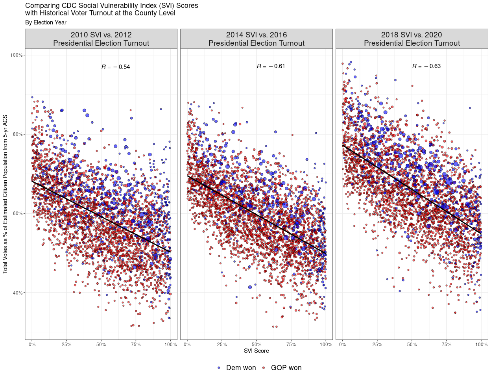
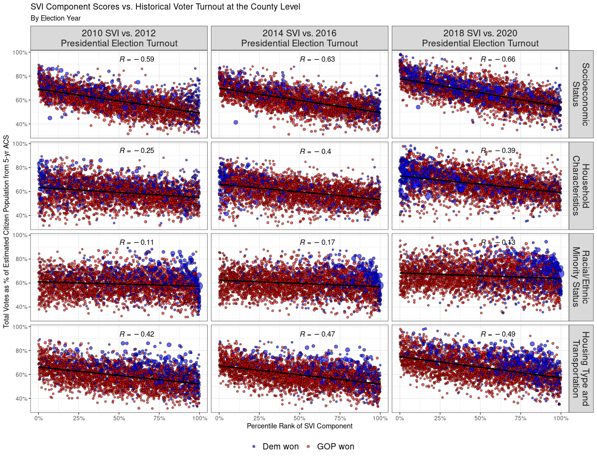
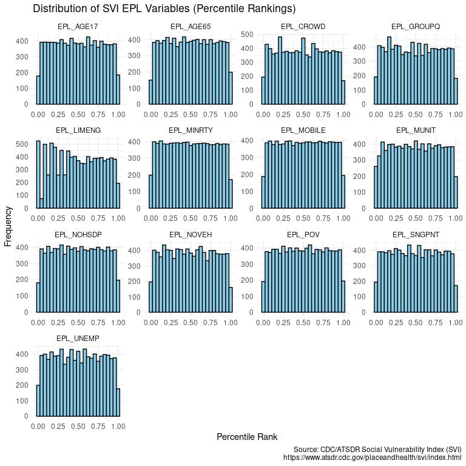
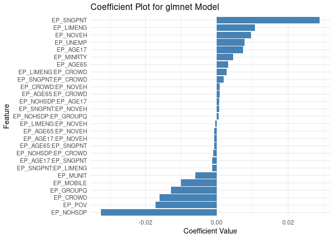

Modeling County-Level Voter Turnout Using the CDC’s Social Vulnerability
Index (SVI)
================
C. Seth Lester, ASA, MAAA
2024-11-01

# Background

This project was inspired by insights shared in a recent LinkedIn post
where I explored whether the CDC’s [Social Vulnerability
Index](https://www.atsdr.cdc.gov/placeandhealth/svi/index.html) (SVI)
could accurately predict county-level voter turnout in US Presidential
elections.

Public presidential polls often use likely voter models to re-weight raw
polling samples, incorporating demographic factors such as
race/ethnicity, poverty level, and education level, which overlap
significantly with components of the SVI. In healthcare analytics, the
SVI is commonly used to account and control for geographic variations in
[social determinants of
health](https://odphp.health.gov/healthypeople/priority-areas/social-determinants-health)
that can influence or confound causal relationships between healthcare
interventions and consequent cost/utilization patterns for a population.

Motivated by [Yubin Park’s concept of blending unrelated datasets to
create “scientific
curries,”](https://www.linkedin.com/posts/yubin-park-phd_does-the-use-of-unusual-combinations-of-datasets-activity-7249938421907865600-oXwk/?utm_source=share&utm_medium=member_desktop)
I set out to investigate how social vulnerabilities might impact civic
engagement - particularly through the lens of examining the relationship
between social vulnerability and voter turnout at the county level of
granularity.

# Data Sources and Methods

The analysis relies on three primary data sources:

## American Community Survey (ACS)

This data is accessed using a [US Census Bureau
API](https://api.census.gov/data/key_signup.html) key and the
`tidycensus` R package. This data provides demographic and population
estimates for counties, which are integral in this analysis for
determining county-level estimates of the Voting Age Population (VAP)
and Voting Eligible Population (VEP). This work of staging this data is
done in the R script `src/get_vep_totals.R`.

The VAP is calculated by determining the number of individuals age 18
and over in a particular county using 5-year ACS data. VEP is calculated
by subtracting the count of non-citizen individuals aged 18 and over
from VAP. While these counts might slightly overestimate true VAP/VEP
due to the inclusion of certain ineligible groups (e.g., felons in some
states), they provide a consistent and reliable set of denominators for
county-level turnout analysis.

As there is generally a 1-2 year lag between the ACS measures for a time
period and the time these measures are compiled and released by the US
Census Bureau, this project uses VAP/VEP totals at the county level
based on the ACS data for the five year period ending in YYYY - 2 for
any presidential election year in YYYY. For example, the VEP/VAP
measures used to calculate turnout rates at the county level for the
2016 election are determined using 5-year ACS measures from 2010 - 2014.

Ultimately, our goal is to devise a prediction model for turnout using
ACS / SVI measures that tend to have a 1-2 year lag in availability.
Ultimately, if we want to build a turnout model to predict 2024 election
turnout, we will need to use 2018 - 2022 5-year ACS measures, as that
will be the latest data available for constructing SVI measures.

## MIT Election Lab

[MIT Election Lab](https://electionlab.mit.edu/data) data contains
historical county-level election returns, including data from 2012,
2016, and 2020. This data allows for a comprehensive analysis of turnout
trends over multiple election cycles. This data is staged in the R
script `src/get_election_data.R`.

This data is relatively straightforward, with one record per county that
is joinable to the VEP/VAP data gathered from ACS and the SVI factors
gathered from the CDC. One issue in this data is tabulations for county
votes in Alaska. Alaska is uncommon in that the entirety of the state is
not subdivided into counties - some people live outside of counties
(Boroughs) - so for the sake of analyzing the relationship between SVI
and turnout, I thought it best to remove Alaska vote data. We’re
removing a very small piece of the sample. Sorry Alaska!

**Caveat**: *don’t* use this turnout model to predict Alaska results!

## CDC Social Vulnerability Index (SVI)

The SVI is produced every 2-4 years by the CDC based on measures
contained in the 5-year ACS data. This freely-downloadable dataset
contains an overall SVI score for counties / census tracts in the US.
The overall SVI score is further distilled from four component scores
that measure social vulnerability on four categories: socioeconomic
status, household composition, racial/ethnic minority status, and
housing type/transportation.

<figure>

<figcaption aria-hidden="true">Image of Captain Planet’s Planeteers
summonning the various components of the SVI.</figcaption>
</figure>

These scores (and their component pieces) are used subsequently in this
analysis to quantify impact of social factors on turnout rates in
Presidential elections. The SVI data required for this analysis is
loaded and staged in the R script `src/get_svi.R`.

The process used by CDC/ATSDR to calculate SVI with the underlying ACS
5-year measures underwent a large number of changes in 2020. In order to
evaluate the concern that SVI (or its components) are not sufficiently
stable over time, I visually evaluated the SVI (and four underlying
component measures) over time for the top 25 largest (by population) US
counties to check that the SVI redesign in 2020 did not led to
substantial volatility in the measure (or, at least, moreso than the
actual year 2020 would have added to the measure).

### 2010 - 2022 SVI for Top 25 Most Populous US Counties

To better understand variation over time in the SVI measures, I examined
the history of variation in the overall SVI measure for the top 25
counties in the US (ranked by population size).

First, we start with overall SVI, which ranks each county in the US by
percentile of overall social vulnerability based on the component sum of
the four social vulnerability themes:

- Socioeconomic Status
- Household Characteristics
- Racial & Ethnic Minority Status
- Housing Type & Transportation

The overall SVI for each county is determined by adding the sum of each
of the percentile rankings of these four themes together for each
particular county, and then percentile-ranking the overall sum for each
county. It’s important to note that no one factor is given larger
“weight” than another in this calculation, which makes the computation
of SVI quite simple - but also might leave something to be desired in
terms of *accurately measuring social vulnerability*.

<!-- -->

Next, I examined the four component SVI themes over time, separately.

#### 2010 - 2022 Socioeconomic Status Component for Top 25 Most Populous US Counties

<!-- -->

#### 2010 - 2022 Household Characteristics Component for Top 25 Most Populous US Counties

<!-- -->

#### 2010 - 2022 Racial & Ethnic Minority Status Component for Top 25 Most Populous US Counties

<!-- -->

#### 2010 - 2022 Housing Type & Transportation Component for Top 25 Most Populous US Counties

<!-- -->

With the possible exception of the third component of SVI (the Racial &
Ethnic Minority Status component), the four SVI components appear to be
relatively stable over time when considering that in 2020 we could
expect a considerable amount of variation in how SVI was measured due to
both pandemic-related factors as well as underlying bias in ACS
measurements sampled in 2020. Another possible explanation for the
instability of the third component could be that in 2020 this component
was heavily redefined.

When considering our intended task of building a turnout model with the
SVI, we might consider using the underlying variables for this cateogory
instead of the component percentile rank variables, as those are more
stable over time.

# Initial Examination

The goal of this project is to eventually use election returns turnout
data for 2012, 2016, and 2020 to develop a turnout model that uses SVI
data from the prior 2 years to predict turnout at the county level.

Prior to beginning this modeling exercise I wanted to better understand
the distribution of our response - presidential election turnout rates
at the county level.

## A first pass examining the distribution of turnout

First we want to understand the distribution of turnout using both our
denominators (VAP and VEP). Note that sometimes (in 11 cases) the total
number of votes received in a county will equal or exceed estimates of
VAP. This is typically due to counties that are VERY small with regard
to population, so the ACS estimate of population is likely to be an
undercount.

The 11 non-Alaska counties where this occurs are very sparsely-populated
rural counties with merely hundreds (at most, 2,416) residents, and were
won by both Democratic and Republican candidates. There is NOT
sufficient data precision in ACS population estimates to prove anything
about unauthorized people voting, so put those silly tinfoil hats away,
please.

First, we want to join our election data (from one source) to our ACS
5-year population estimates for VEP and VAP (from another source). We
will join on FIPS code and then calculate turnout rates using both VAP
and VEP as denominators. Then we will analyze the distribution of both
turnout measures and remove any outliers (perhaps due to very high
turnout in very low-population areas).

We define an outlier for both VAP- and VEP-based turnout rates as any
county for any election year with a turnout rate that exceeds 3 standard
deviations above the mean of turnout. This process removes the 11
counties mentioned above with a VAP/VEP greater than 100%, but plus an
additional 21 (extremely low population) counties with a turnout rate
that is likely overestimated due to an undercounted denominator. With
over 3,000 counties in our sample for each election year, we’re losing
very little sample space by doing this!

<!-- -->

## Turnout over time

Since I intend to use data from 2012, 2016, and 2020 presidential
elections to build the turnout model, I thought it best to next examine
election turnout rates over time for the top 25 counties, as I did
earlier with SVI and its four component themes.

<!-- -->

## Turnout vs. SVI in Presidential Elections

Finally, having combined turnout rates and corresponding 2-year-lagged
SVI data for the three presidential election years, I plotted the
relationship between overall SVI at the county level and county-level
turnout rates.

<!-- -->

The image above suggests a relatively moderate negative Pearson
correlation (R) between SVI and turnout rates. I thought this was pretty
darn interesting, so I posted a version of this chart on
[LinkedIn](https://www.linkedin.com/posts/csethlester_can-the-cdcs-social-vulnerability-index-activity-7259468140282019841-7ue4?utm_source=share&utm_medium=member_desktop).

I then examined this relationship further by examining the correlation
at the 4 primary SVI component measures as compared to turnout rates,
where I also found remarkable stability within each SVI component
measure over the three presidential elections.

<!-- -->

Just from a cursory scan at Pearson correlation broken out by the four
major SVI components, it looks like the real breadwinner varibles for a
potential turnout model will come from the Socioeconomic Status and
Housing Type/Transportation categories, with perhaps some useful
information in the Household Characteristics category. It seems
unintuitive that racial/ethnic identity would have a meaningful
relationship with turnout rates for a county, but we’ll also consider
component features from this SVI category as we build our prediction
model.

# Let’s Build a Turnout Model!

OK, enough description of the data - let’s use SVI to predict the
future!

## What are we modeling?

We want a model that will predict turnout for election year YYYY based
on the SVI file for YYYY - 2. Also, it is my hope that our model will
predict not *absolute* turnout (that is, number of votes in each
county), but rather, a US county’s *relative* turnout expressed as a
multiplicative factor of the state-level turnout.

Since different states will have different degrees of turnout relative
to other factors (e.g., ad spending, swing state status, etc.), the
model is intended to be used as a means to predict turnout relativities
between counties in a particular state. I will demonstrate usage of the
model in a final section to predict turnout in my home state of North
Carolina in the 2024 election.

(Also, if you’re following along at home, I designed this model like a
risk adjustment model.)

In short, we will train our model on a response that is the value of
turnout multiplicitavely scaled by dividing the turnout rate variable
for each county by its own average across all counties for each election
year. Then, when our model predicts a turnout score of 1.00 +/- x, we
will interpret that to mean that the county is expected to have a
turnout equal to 1.00 +/- x times the average turnout across all
counties for that election (represented by 1.00).

## Should we include 2020 data?

Furthermore, 2020 presented some unique challenges (and unique
motivations) that might not reflect more stable patterns reflecting the
general relationship between SVI variables and voter turnout.

Before writing all this up, I examined the performance between two
models - one trained including 2020 data, and one trained without 2020
data - and found no material difference in predictive performance.

Therefore, 2020 data is included.

## Model Design and Feature Selection

### Inaugural Feature Set

Ideally we would want a model that is trained on pre-2024 returns data,
but predictive of turnout outcomes in 2024. The variables used to
measure overall SVI across all four categories which are present across
**all versions** of the SVI data available (2010 - 2022) are as follows:

| SVI Feature | Description                                                                               |
|-------------|-------------------------------------------------------------------------------------------|
| EPL_POV\*   | Percentile percentage of persons below 100% (2010 - 2020) / 150% (2020+) poverty estimate |
| EPL_UNEMP   | Percentile percentage of civilian (age 16+) unemployed estimate                           |
| EPL_NOHSDP  | Percentile percentage of persons with no high school diploma (age 25+) estimate           |
| EPL_AGE65   | Percentile percentage of persons aged 65 and older estimate                               |
| EPL_AGE17   | Percentile percentage of persons aged 17 and younger estimate                             |
| EPL_SNGPNT  | Percentile percentage of single-parent households with children under 18 estimate         |
| EPL_LIMENG  | Percentile percentage of persons (age 5+) who speak English “less than well”              |
| EPL_MINRTY  | Percentile percentage of persons who identify as a racial/ethnic identity in the minority |
| EPL_MUNIT   | Percentile percentage housing in structures with 10 or more units                         |
| EPL_MOBILE  | Percentile percentage mobile homes                                                        |
| EPL_CROWD   | Percentile percentage households with more than 1 person per room                         |
| EPL_NOVEH   | Percentile percentage households with no vehicle available                                |
| EPL_GROUPQ  | Percentile percentage of persons in group quarters estimate                               |

Often a very good *first step* in building a predictive model is to get
a handle on your feature space - including understanding their
distribution. Since the EPL\_\* varaibles are percentile ranks, we can
expect that these variables are all likely expressive of a uniform
distribution across a support of 0 to 100%. Let’s confirm that now:

    ## Joining with `by = join_by(GEOID, year)`

<!-- -->

We have now confirmed that every variable in the feature space reflects
a Uniform(0,100) distribution. This might not be an approach that will
lead to a feature space that sets us up with a high-performing
predictive model, so let’s investigate the non-percentile-ranked (i.e.,
estimates of proportions) variables underlying these within the loaded
SVI datasets.

Each of these percentile ranked measurements are based on a US-wide
percentile ranking of underlying proportion measures that are drawn
directly from ACS 5-year data for the applicable time period. Each of
these proportion measures is also present in SVI datasets.

| SVI Feature | Description                                                                    |
|-------------|--------------------------------------------------------------------------------|
| EP_POV\*    | Percentage of persons below 100% (2010 - 2020) / 150% (2020+) poverty estimate |
| EP_UNEMP    | Percentage of civilian (age 16+) unemployed estimate                           |
| EP_NOHSDP   | Percentage of persons with no high school diploma (age 25+) estimate           |
| EP_AGE65    | Percentage of persons aged 65 and older estimate                               |
| EP_AGE17    | Percentage of persons aged 17 and younger estimate                             |
| EP_SNGPNT   | Percentage of single-parent households with children under 18 estimate         |
| EP_LIMENG   | Percentage of persons (age 5+) who speak English “less than well”              |
| EP_MINRTY   | Percentage of persons who identify as a racial/ethnic identity in the minority |
| EP_MUNIT    | Percentage housing in structures with 10 or more units                         |
| EP_MOBILE   | Percentage mobile homes                                                        |
| EP_CROWD    | Percentage households with more than 1 person per room                         |
| EP_NOVEH    | Percentage households with no vehicle available                                |
| EP_GROUPQ   | Percentage of persons in group quarters estimate                               |

    ## Joining with `by = join_by(GEOID, year)`

<!-- -->

Now we will build some candidate models for our final predictive model
for relative county-level turnout. This gives us an overview of how this
feature set’s relationship with the target response (`scaled_turnout`)
are described by the underlying data.

    ## 
    ## Call:
    ## lm(formula = formula_ep, data = all_years)
    ## 
    ## Residuals:
    ##      Min       1Q   Median       3Q      Max 
    ## -0.47285 -0.06017 -0.00932  0.05096  0.62296 
    ## 
    ## Coefficients:
    ##               Estimate Std. Error t value Pr(>|t|)    
    ## (Intercept)  1.216e+00  1.852e-02  65.665  < 2e-16 ***
    ## EP_POV      -4.063e-03  2.664e-04 -15.249  < 2e-16 ***
    ## EP_UNEMP    -1.242e-03  3.977e-04  -3.123  0.00180 ** 
    ## EP_NOHSDP   -3.424e-03  2.673e-04 -12.808  < 2e-16 ***
    ## EP_AGE65     5.056e-04  3.741e-04   1.352  0.17654    
    ## EP_AGE17    -1.460e-03  5.338e-04  -2.734  0.00627 ** 
    ## EP_SNGPNT   -7.193e-03  5.330e-04 -13.493  < 2e-16 ***
    ## EP_LIMENG   -2.637e-03  5.795e-04  -4.550 5.43e-06 ***
    ## EP_MINRTY    2.204e-03  8.447e-05  26.097  < 2e-16 ***
    ## EP_MUNIT    -5.470e-04  2.972e-04  -1.840  0.06578 .  
    ## EP_MOBILE    2.681e-04  1.550e-04   1.730  0.08370 .  
    ## EP_CROWD    -6.706e-03  8.149e-04  -8.229  < 2e-16 ***
    ## EP_NOVEH    -3.057e-03  3.928e-04  -7.781 7.96e-15 ***
    ## EP_GROUPQ   -1.165e-02  2.971e-04 -39.218  < 2e-16 ***
    ## ---
    ## Signif. codes:  0 '***' 0.001 '**' 0.01 '*' 0.05 '.' 0.1 ' ' 1
    ## 
    ## Residual standard error: 0.09746 on 9277 degrees of freedom
    ## Multiple R-squared:  0.3978, Adjusted R-squared:  0.3969 
    ## F-statistic: 471.3 on 13 and 9277 DF,  p-value: < 2.2e-16

    ## 
    ## Call:
    ## lm(formula = formula_epl, data = all_years)
    ## 
    ## Residuals:
    ##      Min       1Q   Median       3Q      Max 
    ## -0.46972 -0.05836 -0.00347  0.05483  0.64986 
    ## 
    ## Coefficients:
    ##              Estimate Std. Error t value Pr(>|t|)    
    ## (Intercept)  1.153374   0.007673 150.319  < 2e-16 ***
    ## EPL_POV     -0.074055   0.006143 -12.055  < 2e-16 ***
    ## EPL_UNEMP   -0.017210   0.004770  -3.608 0.000311 ***
    ## EPL_NOHSDP  -0.141038   0.006081 -23.193  < 2e-16 ***
    ## EPL_AGE65    0.037088   0.005111   7.257 4.28e-13 ***
    ## EPL_AGE17    0.015648   0.005177   3.022 0.002514 ** 
    ## EPL_SNGPNT  -0.058820   0.005571 -10.559  < 2e-16 ***
    ## EPL_LIMENG  -0.033557   0.004870  -6.890 5.95e-12 ***
    ## EPL_MINRTY   0.132302   0.005455  24.253  < 2e-16 ***
    ## EPL_MUNIT   -0.047356   0.005250  -9.021  < 2e-16 ***
    ## EPL_MOBILE  -0.006207   0.005429  -1.143 0.252902    
    ## EPL_CROWD   -0.009761   0.004717  -2.069 0.038554 *  
    ## EPL_NOVEH   -0.026778   0.005033  -5.320 1.06e-07 ***
    ## EPL_GROUPQ  -0.137538   0.004014 -34.263  < 2e-16 ***
    ## ---
    ## Signif. codes:  0 '***' 0.001 '**' 0.01 '*' 0.05 '.' 0.1 ' ' 1
    ## 
    ## Residual standard error: 0.09689 on 9277 degrees of freedom
    ## Multiple R-squared:  0.4047, Adjusted R-squared:  0.4039 
    ## F-statistic: 485.2 on 13 and 9277 DF,  p-value: < 2.2e-16

<!-- -->

Out of the gate, our basic vanilla linear models explain the data quite
well, with an adjusted R-squared hovering around 40% and with a feature
space filled with highly-significant variables, for both the model based
on EP\_ (proportion estimates) variables as well as the model based on
EPL\_ (percentile ranked) variables in the SVI. So, that’s great news!

Given that we are getting similar predictive performance from both the
EP\_ and EPL\_ series variables, I’ve chosen to proceed with the EP\_
variables because the coefficients for our model will have a more
intuitive, commonsense interpretation than with the EPL\_ variables. The
coefficients corresponding to EP\_ variables allow us to make statements
like “For every 1% increase in the estimated proportion of X, we can
expect a Y% increase/decrease in turnout for that county.” You know, for
the sake of model explainability and all!

### Evaluating Multicollinearity in the Feature Set

We might imagine there is substantial multicollinearity in the feature
space, so we should be aware of any strong correlations between our 13
features going into the modeling project. As a matter of good model
design practice, let’s take a peek at a correlation matrix for our SVI
features. We’ll see nothing here that doesn’t make a lot of sense.

<!-- -->

### Motivating Regularization

Here, we see some obvious correlation between several of these features.
One obvious example to call out is the moderate negative correlation
between EP_AGE17 and EP_AGE65. Our hope is that we can rely on
regularization to mute (or deselect entirely) some of these features
where multicollinearity between certain features can inject bias into
our predictive model.

Using R’s `glmnet` package, we can use regularization to arrive at a
more parsimonious (i.e., potentially fewer features) model with at least
similar predictive performance to the basic OLS models we fitted to SVI
variables earlier. This approach will *also* give us the ability to
consider any number of interactions between these features, where
interactions with a less-than-impactful contribution to predicting the
response will be “penalized” out through the regularization process.

As mentioned above approach will also have the benefit of hopefully
removing (via regularization penalization) some of the SVI features
where there is excessive multicollinearity (if any). Using `glmnet`,
I’ve fixed the alpha parameter to 1, forcing a lasso regularization
regime with L2 distances penalization, which is known to be better at
“culling” the feature space to arrive at a more parsimonious model with
fewer features).

### Lasso Model Results

Using a matrix containing all EP\_ features as well as all interaction
features, below shows a chart with the regressor values for primary
variables and interactions that emerged from the `glmnet` process (where
features where the absolute value of the regressor term is greater than
.0005, as well as the intercept, are both excluded).

    ## [1] 0.4829816

<!-- -->

# Testing the model on North Carolina’s 2024 results

Finally, I want to test my model on my home state’s results in 2024.
Here the model performs quite well, showing an overall R-squared of .99
(!) on this data. Wow. Don’t have time to unpack this now but will poke
around later.

    ## Joining with `by = join_by(GEOID, year)`

| LOCATION                            | Predicted_Votes | Actual_Votes | Absolute_Error_Pct |
|:------------------------------------|----------------:|-------------:|:-------------------|
| Alamance County, North Carolina     |           91297 |        89831 | 1.63%              |
| Alexander County, North Carolina    |           21013 |        20677 | 1.62%              |
| Alleghany County, North Carolina    |            6786 |         6496 | 4.46%              |
| Anson County, North Carolina        |           11731 |        10875 | 7.87%              |
| Ashe County, North Carolina         |           16324 |        16253 | 0.44%              |
| Avery County, North Carolina        |            9388 |         9489 | 1.06%              |
| Beaufort County, North Carolina     |           26213 |        26572 | 1.35%              |
| Bertie County, North Carolina       |           10748 |         9186 | 17.00%             |
| Bladen County, North Carolina       |           17070 |        16764 | 1.83%              |
| Brunswick County, North Carolina    |           99952 |       108773 | 8.11%              |
| Buncombe County, North Carolina     |          156465 |       160510 | 2.52%              |
| Burke County, North Carolina        |           49230 |        45847 | 7.38%              |
| Cabarrus County, North Carolina     |          123899 |       120202 | 3.08%              |
| Caldwell County, North Carolina     |           44251 |        43540 | 1.63%              |
| Camden County, North Carolina       |            6463 |         6304 | 2.52%              |
| Carteret County, North Carolina     |           42678 |        45817 | 6.85%              |
| Caswell County, North Carolina      |           13388 |        12040 | 11.20%             |
| Catawba County, North Carolina      |           86862 |        87109 | 0.28%              |
| Chatham County, North Carolina      |           47009 |        52319 | 10.15%             |
| Cherokee County, North Carolina     |           18990 |        17824 | 6.54%              |
| Chowan County, North Carolina       |            7981 |         7552 | 5.68%              |
| Clay County, North Carolina         |            7190 |         7728 | 6.96%              |
| Cleveland County, North Carolina    |           53665 |        51706 | 3.79%              |
| Columbus County, North Carolina     |           27015 |        27110 | 0.35%              |
| Craven County, North Carolina       |           54428 |        55645 | 2.19%              |
| Cumberland County, North Carolina   |          160963 |       140623 | 14.46%             |
| Currituck County, North Carolina    |           17851 |        18053 | 1.12%              |
| Dare County, North Carolina         |           25244 |        25196 | 0.19%              |
| Davidson County, North Carolina     |           93229 |        93452 | 0.24%              |
| Davie County, North Carolina        |           25384 |        26850 | 5.46%              |
| Duplin County, North Carolina       |           23759 |        22900 | 3.75%              |
| Durham County, North Carolina       |          175096 |       180910 | 3.21%              |
| Edgecombe County, North Carolina    |           27011 |        24451 | 10.47%             |
| Forsyth County, North Carolina      |          195287 |       203291 | 3.94%              |
| Franklin County, North Carolina     |           38997 |        42667 | 8.60%              |
| Gaston County, North Carolina       |          125635 |       119256 | 5.35%              |
| Gates County, North Carolina        |            6363 |         5868 | 8.44%              |
| Graham County, North Carolina       |            4581 |         4779 | 4.14%              |
| Granville County, North Carolina    |           32982 |        32109 | 2.72%              |
| Greene County, North Carolina       |            8887 |         8450 | 5.17%              |
| Guilford County, North Carolina     |          277263 |       285053 | 2.73%              |
| Halifax County, North Carolina      |           27635 |        23851 | 15.87%             |
| Harnett County, North Carolina      |           69408 |        63757 | 8.86%              |
| Haywood County, North Carolina      |           38051 |        37851 | 0.53%              |
| Henderson County, North Carolina    |           72179 |        69974 | 3.15%              |
| Hertford County, North Carolina     |           11856 |         9818 | 20.76%             |
| Hoke County, North Carolina         |           26304 |        22767 | 15.54%             |
| Hyde County, North Carolina         |            2584 |         2421 | 6.73%              |
| Iredell County, North Carolina      |          107946 |       110875 | 2.64%              |
| Jackson County, North Carolina      |           23066 |        21942 | 5.12%              |
| Johnston County, North Carolina     |          117218 |       124678 | 5.98%              |
| Jones County, North Carolina        |            5511 |         5463 | 0.88%              |
| Lee County, North Carolina          |           31533 |        30081 | 4.83%              |
| Lenoir County, North Carolina       |           28728 |        27503 | 4.45%              |
| Lincoln County, North Carolina      |           52929 |        55582 | 4.77%              |
| McDowell County, North Carolina     |           24218 |        23655 | 2.38%              |
| Macon County, North Carolina        |           22891 |        21934 | 4.36%              |
| Madison County, North Carolina      |           12708 |        13621 | 6.70%              |
| Martin County, North Carolina       |           13044 |        12040 | 8.34%              |
| Mecklenburg County, North Carolina  |          600072 |       577527 | 3.90%              |
| Mitchell County, North Carolina     |            8569 |         8846 | 3.13%              |
| Montgomery County, North Carolina   |           13906 |        13179 | 5.52%              |
| Moore County, North Carolina        |           61705 |        61819 | 0.18%              |
| Nash County, North Carolina         |           52048 |        52471 | 0.81%              |
| New Hanover County, North Carolina  |          136068 |       138734 | 1.92%              |
| Northampton County, North Carolina  |           11202 |         9215 | 21.56%             |
| Onslow County, North Carolina       |           94539 |        81681 | 15.74%             |
| Orange County, North Carolina       |           79838 |        87807 | 9.08%              |
| Pamlico County, North Carolina      |            8043 |         7976 | 0.84%              |
| Pasquotank County, North Carolina   |           22183 |        20343 | 9.04%              |
| Pender County, North Carolina       |           35606 |        38909 | 8.49%              |
| Perquimans County, North Carolina   |            8273 |         7666 | 7.92%              |
| Person County, North Carolina       |           23140 |        22036 | 5.01%              |
| Pitt County, North Carolina         |           87087 |        87131 | 0.05%              |
| Polk County, North Carolina         |           13246 |        13068 | 1.36%              |
| Randolph County, North Carolina     |           76418 |        76045 | 0.49%              |
| Richmond County, North Carolina     |           21878 |        19873 | 10.09%             |
| Robeson County, North Carolina      |           57056 |        46770 | 21.99%             |
| Rockingham County, North Carolina   |           49722 |        49595 | 0.26%              |
| Rowan County, North Carolina        |           77109 |        75394 | 2.27%              |
| Rutherford County, North Carolina   |           36216 |        34670 | 4.46%              |
| Sampson County, North Carolina      |           28525 |        27969 | 1.99%              |
| Scotland County, North Carolina     |           16984 |        14626 | 16.12%             |
| Stanly County, North Carolina       |           34426 |        36714 | 6.23%              |
| Stokes County, North Carolina       |           26854 |        27175 | 1.18%              |
| Surry County, North Carolina        |           37697 |        37508 | 0.50%              |
| Swain County, North Carolina        |            7635 |         7052 | 8.27%              |
| Transylvania County, North Carolina |           21627 |        20780 | 4.08%              |
| Tyrrell County, North Carolina      |            1741 |         1757 | 0.91%              |
| Union County, North Carolina        |          134750 |       139355 | 3.30%              |
| Vance County, North Carolina        |           22537 |        20092 | 12.17%             |
| Wake County, North Carolina         |          647679 |       653580 | 0.90%              |
| Warren County, North Carolina       |           11327 |        10013 | 13.12%             |
| Washington County, North Carolina   |            6234 |         5944 | 4.88%              |
| Watauga County, North Carolina      |           29884 |        33095 | 9.70%              |
| Wayne County, North Carolina        |           58100 |        54762 | 6.10%              |
| Wilkes County, North Carolina       |           36290 |        36320 | 0.08%              |
| Wilson County, North Carolina       |           41333 |        40045 | 3.22%              |
| Yadkin County, North Carolina       |           20656 |        20397 | 1.27%              |
| Yancey County, North Carolina       |           11187 |        11287 | 0.89%              |

    ## # A tibble: 100 × 4
    ##    LOCATION                      Predicted_Votes Actual_Votes Absolute_Error_Pct
    ##    <chr>                                   <int>        <dbl> <chr>             
    ##  1 Alamance County, North Carol…           91297        89831 1.63%             
    ##  2 Alexander County, North Caro…           21013        20677 1.62%             
    ##  3 Alleghany County, North Caro…            6786         6496 4.46%             
    ##  4 Anson County, North Carolina            11731        10875 7.87%             
    ##  5 Ashe County, North Carolina             16324        16253 0.44%             
    ##  6 Avery County, North Carolina             9388         9489 1.06%             
    ##  7 Beaufort County, North Carol…           26213        26572 1.35%             
    ##  8 Bertie County, North Carolina           10748         9186 17.00%            
    ##  9 Bladen County, North Carolina           17070        16764 1.83%             
    ## 10 Brunswick County, North Caro…           99952       108773 8.11%             
    ## # ℹ 90 more rows

    ## # A tibble: 1 × 3
    ##   Predicted_Votes Actual_Votes MAPE 
    ##             <int>        <dbl> <chr>
    ## 1         5745767      5697116 5.47%

    ## [1] "R squared:  0.997845805380116"
